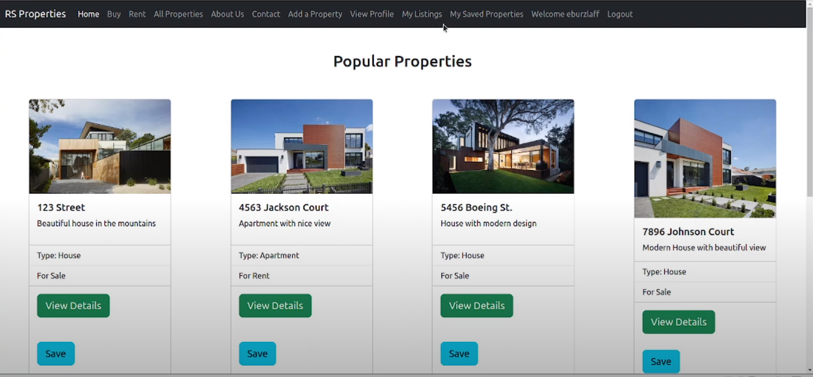

# Real Estate App - Java Maven Project from Enterprise Java class - Madison College

# [Youtube Demo Presentation Link](https://www.youtube.com/watch?v=eT4bvYaDSXw)

### Description
The Real Estate App allows potential buyers and sellers to have a platform where they can look for various properties or add properties to move and instigate the real state industry ecosystem of transactions. 

### Project Technologies/Techniques

* Programming Language/s
    * Java
* Database
    * MySQL 8.0.22
* ORM Framework
    * Hibernate 5
* Dependency Management
    * Maven
* Styling
    * CSS Bootstrap
* Logging
    * Log4J2
* Hosting
    * AWS Elastic Beanstalk
* Authentication
    * AWS Cognito
* Unit Testing Framework
    * JUnit
* IDE: IntelliJ IDEA

### Design

* [User Stories](DesignDocuments/UserStories/userStories.md)
* [Tasks](DesignDocuments/TasksByStory/tasks.md)
* [Screen Design](DesignDocuments/ScreenDesign/Wireframe.pdf)
* [Application Flow](DesignDocuments/ApplicationFlow/applicationFlow.md)
* [Database Design](DesignDocuments/DatabaseDiagram/databaseDiagram.png)

### Project Plan
* [Project Plan](ProjectPlan.md)

### Documentation of progress, reflections, and time spent on this class

#### [Weekly Reflection Journal](WeeklyReflectionJournal.md)
#### [Time Log](TimeLog.md)

### Self Evaluations

* [Mid-Term Self Evaluation](DesignDocuments/SelfEvaluations/midTermSelfEvaluation.md)
* [Second Self Evaluation](DesignDocuments/SelfEvaluations/SecondSelfEvaluation.md)
* [Final Self Evaluation](DesignDocuments/SelfEvaluations/FinalSelfEvaluation.md)

